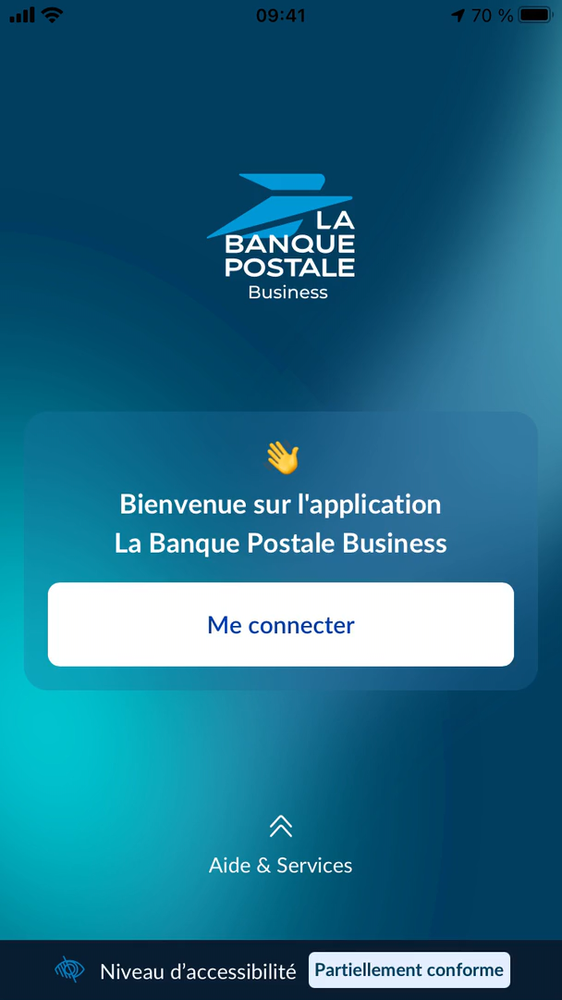

# BusinessJB

Disables jailbreak detection in La Banque Postale by forcing `JailbreakDetection\n- (bool)jailbroken` to return `FALSE`.

- **App**: [Business – La Banque Postale](https://apps.apple.com/fr/app/business-la-banque-postale/id1438089314)
- **Latest version**: 2.3.000
- **Tested on**: iOS 15.8.6

## Build

```sh
make clean && make package THEOS_PACKAGE_SCHEME=rootless DEBUG=0
```

## Inject

```sh
cyan -i com.labanquepostale.business-2.3.000.ipa \
     -o com.labanquepostale.business-2.3.000_patched.ipa \
     -f xyz.nohamr.businessjb_1.0.0-1_iphoneos-arm64.deb \
     -u
```

## Screenshots

