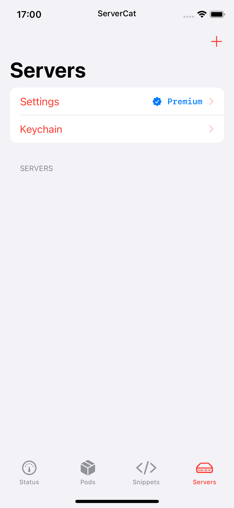
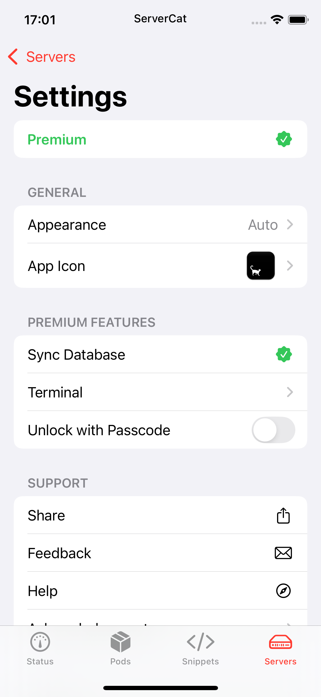

# ServerCatPremium

Unlocks premium features in ServerCat by forcing `isPremiumActive` (`sub_10009CD24`) to always return `1`.

- **App**: [ServerCat – SSH Terminal](https://apps.apple.com/us/app/servercat-ssh-terminal/id1501532023)
- **Tested on**: ServerCat 1.30.0 (600), iOS 18.3

## Build

```sh
make clean && make package THEOS_PACKAGE_SCHEME=rootless DEBUG=0
```

## Inject

```sh
cyan -i tech.baye.servercat-1.30.0.ipa \
     -o tech.baye.servercat-1.30.0_patched.ipa \
     -f xyz.nohamr_1.0.0-1_iphoneos-arm64.deb \
     -u
```

## Screenshots

