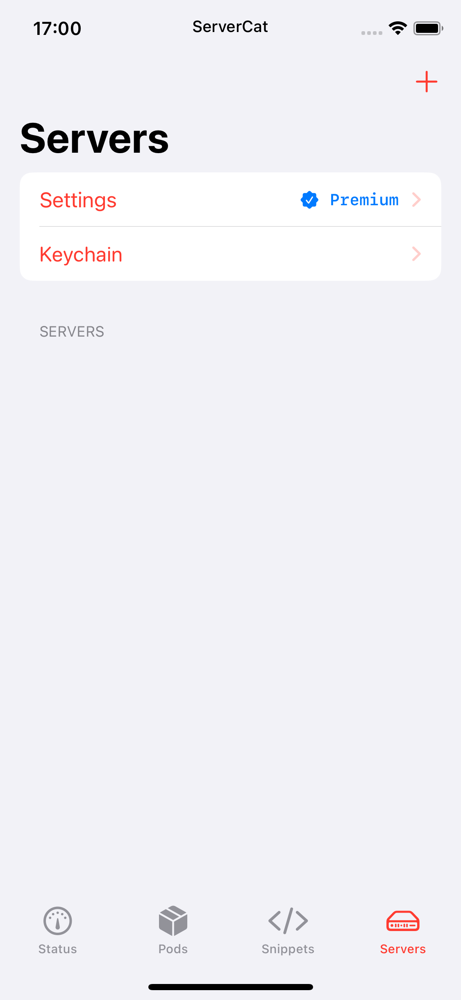
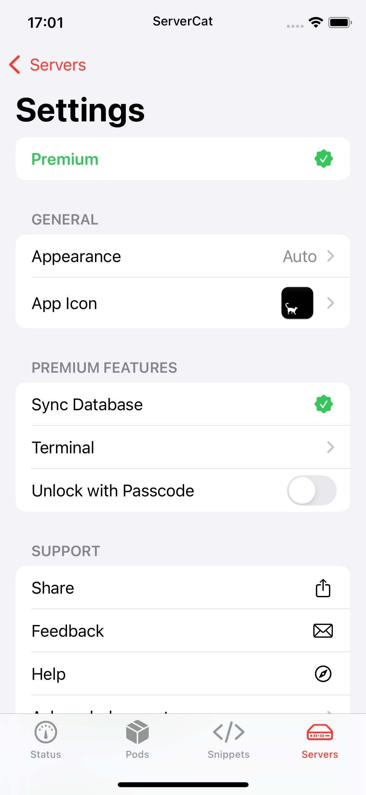

# ServerCatPremium

Unlocks premium features in ServerCat by forcing `isPremiumActive` to always return `1`.

- **App**: [ServerCat – SSH Terminal](https://apps.apple.com/us/app/servercat-ssh-terminal/id1501532023)
- **Tested on**: ServerCat 1.30.0 (iOS 18.3) and ServerCat 1.6.4 (iOS 15.8.6)

Hook address offsets (edit in `Tweak.x`):
- `0x10009CD24` — ServerCat 1.30.0
- `0x100454D70` — ServerCat 1.6.4

## Build

```sh
make clean && make package THEOS_PACKAGE_SCHEME=rootless DEBUG=0
```

## Inject

```sh
cyan -i <input.ipa> -o <output_patched.ipa> -f xyz.nohamr_1.0.0-1_iphoneos-arm64.deb -u
```

## Screenshots


