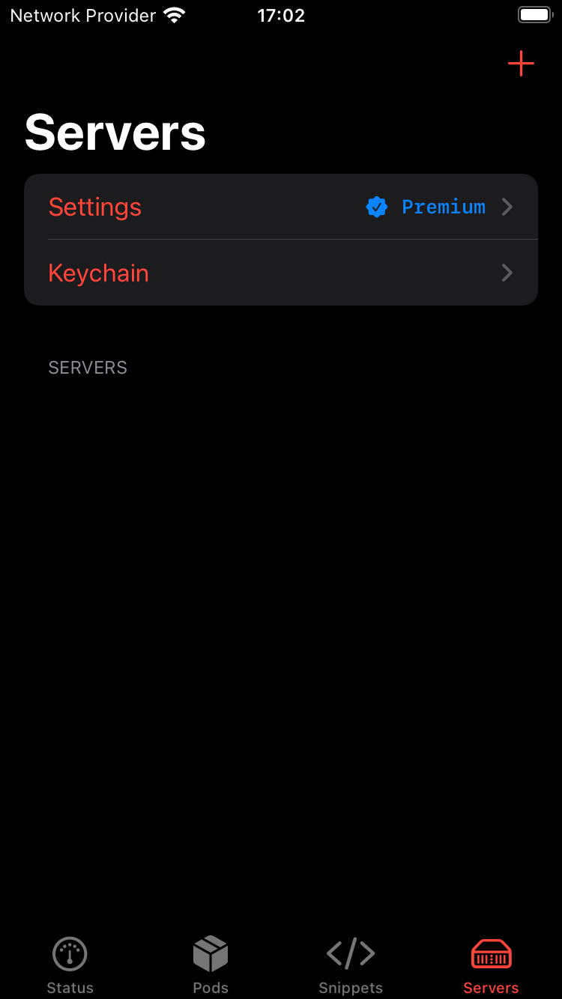
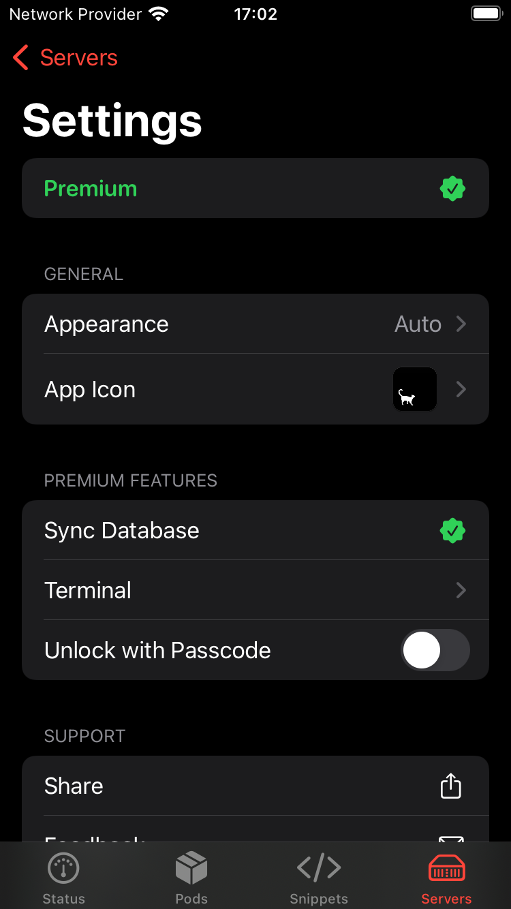

# ServerCatPremium (legacy — iOS 15)

Unlocks premium features in ServerCat by forcing `isPremiumActive` (`sub_100454D70`) to always return `1`.

- **App**: [ServerCat – SSH Terminal](https://apps.apple.com/us/app/servercat-ssh-terminal/id1501532023)
- **Tested on**: ServerCat 1.6.4, iOS 15.8.6
- **Note**: ServerCat 1.6.4 is the last version supporting iOS 15. Latest requires iOS 17+.

## Build

```sh
make clean && make package THEOS_PACKAGE_SCHEME=rootless DEBUG=0
```

## Inject

```sh
cyan -i tech.baye.servercat-1.6.4.ipa \
     -o tech.baye.servercat-1.6.4_patched.ipa \
     -f xyz.nohamr_1.0.0-1_iphoneos-arm64.deb \
     -u
```

## Screenshots

